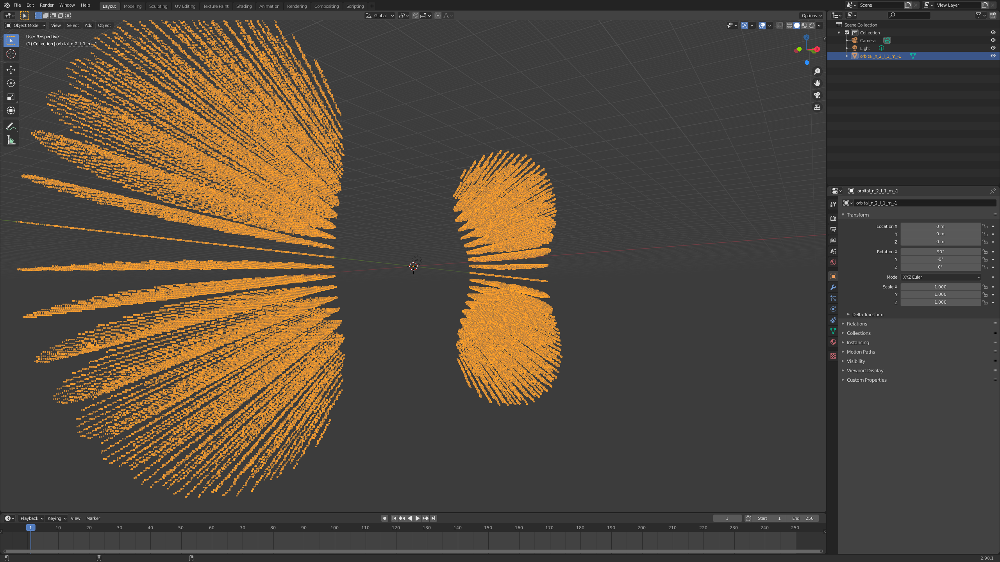

# Electron Orbitals

Plotting electron orbitals for fun and profit.

## Screenshots

### n=1

**1s orbital**

### n=2

**2s orbital**

**2p (m=0) orbital**

 orbital")

**2p (m=1) orbital**

 orbital")

### n=3

**3s orbital**

**3p (m=0) orbital**

 orbital")

**3p (m=1) orbital**

 orbital")

**3d (m=0) orbital**

 orbital")

**3d (m=1) orbital**

 orbital")

**3d (m=2) orbital**

 orbital")

### Extra

